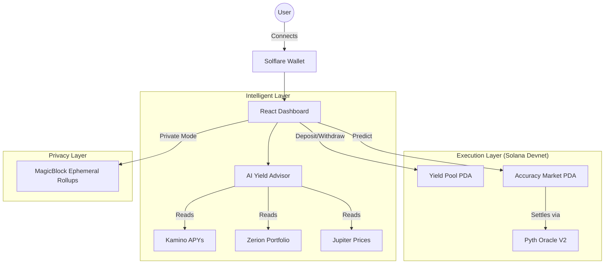

# 🛡️ PrivyFi: The High-Precision DeFi Suite on Solana

> **AI-Powered Yield Optimization + Convex Accuracy Markets + On-Chain Privacy.**

---

## 🌟 Overview

PrivyFi is a premium DeFi ecosystem built for the **Solana Frontier** hackathon. It bridges the gap between passive yield farming and active price speculation through a suite of intelligent tools:

1.  **🤖 AI Yield Advisor**: Leverages Llama 3.3 to analyze live Kamino APYs and Zerion portfolio data, delivering personalized investment strategies in plain English.
2.  **🎯 Accuracy Markets**: A unique prediction market where "closeness counts." Unlike binary "Up/Down" markets, PrivyFi rewards users based on how close their prediction was to the actual price using a **Convex Weighting System**.
3.  **🔒 Private Mode**: Toggle on-chain privacy via **MagicBlock Ephemeral Rollups (PER)** to shield your positions from public view.
4.  **⚡ Efficient Execution**: Optimized Anchor program featuring "Batch Cranking" to settle hundreds of predictions with minimal Compute Unit (CU) consumption and automated rent reclamation.

---

## 🏛️ Architecture



---

## 🛠️ Smart Contract Features

### 1. Accuracy Markets (The "Convex" Edge)
Unlike traditional markets, PrivyFi calculates a **Median Error** for every round.
- **Winners**: Users whose prediction error is less than the median.
- **Rewards**: Calculated using `(Median - Error)^2`, ensuring that being "very right" pays out exponentially more than being "just right."

### 2. High-Frequency Cranking
The `crank_payouts` instruction is designed for bot operators:
- **Batch Processing**: Settle multiple users in a single transaction.
- **Rent Bounty**: The operator who "cranks" the market receives the SOL rent from closed user accounts as a reward.

---

## 📂 Project Structure

```text
privyfi/
├── programs/privyfi/src/
│   ├── instructions/          ← Core logic: Accuracy Markets, Yields, Faucets
│   ├── state/                 ← PDAs: AccuracyMarket, UserPrediction, YieldStore
│   ├── errors.rs              ← Custom Solana error codes
│   └── lib.rs                 ← Main program entry
├── app/
│   ├── src/hooks/             ← usePredictionMarket, useAI, useAnchorProgram
│   ├── src/components/        ← Premium UI: Glassmorphism Dashboard, Charts
│   └── api/                   ← Serverless backend for AI & Data
├── tests/                     ← Comprehensive LiteSVM & Bankrun test suite
└── Anchor.toml                ← Workspace configuration
```

---

## 🚀 Getting Started

### Prerequisites
- **Anchor CLI 1.0**
- **Solana CLI 1.18+**
- **Node.js 20+ (pnpm recommended)**

### Installation & Deployment

```bash
# 1. Clone the repository
git clone https://github.com/HkSolDev/PrivyFi.git
cd PrivyFi

# 2. Build the contract
anchor build

# 3. Run the test suite (LiteSVM)
anchor test

# 4. Deploy to Devnet
solana config set --url devnet
anchor deploy
```

---

## 📜 License

This project is licensed under the **MIT License**.

---

*Built with 🦀 and ☕ for the Solana Frontier Hackathon 2026.*
